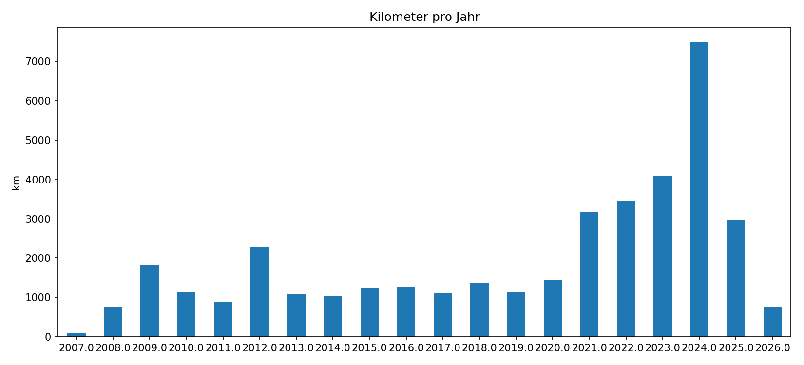
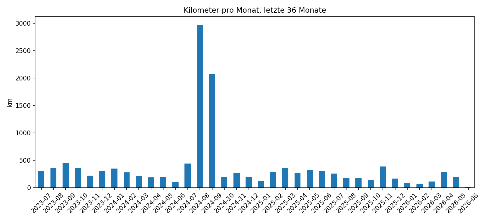
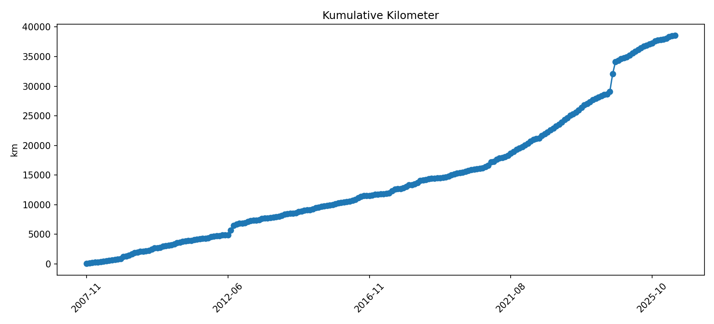
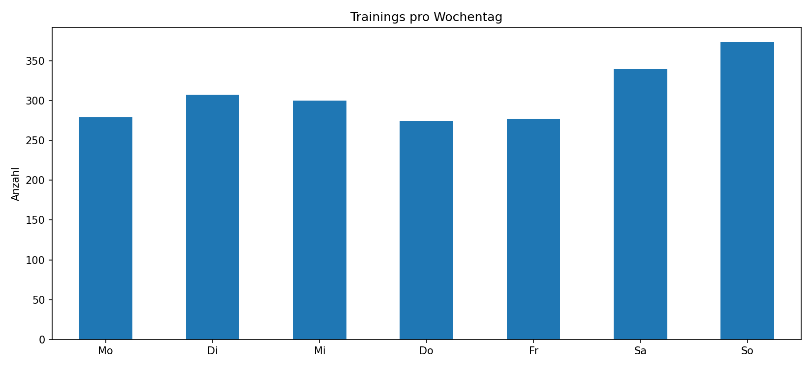
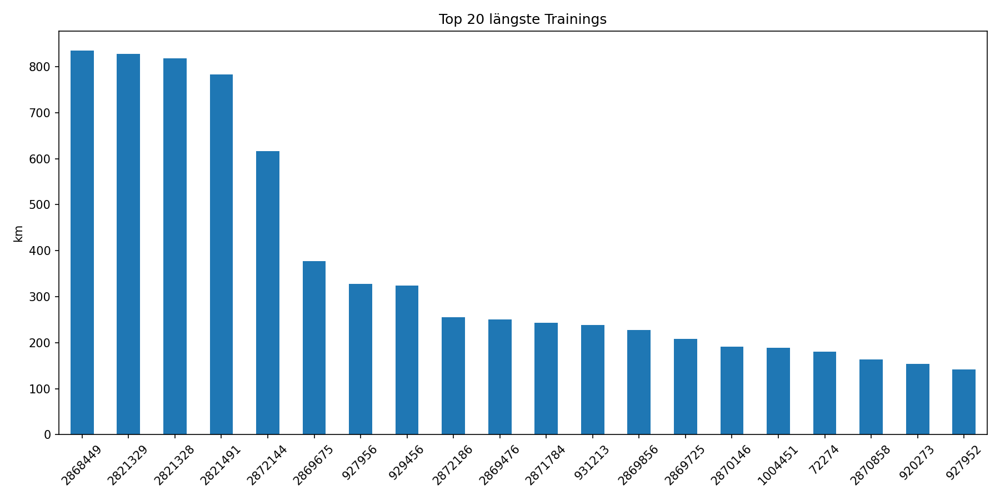

# RunGPS Trainingsstatistik

_Automatisch erzeugt aus den TCX-Dateien in `RunGPSData/Trainings`._

## Überblick

- Trainings: **2.162**
- Gesamtdistanz: **41.083,3 km**
- Gesamtdauer: **6.629,5 h**
- Positive Höhenmeter, aus Trackpunkten geschätzt: **126.015 m**
- Zeitraum: **2007-11-24 bis 2026-06-08**
- Trainings mit GPS-Startpunkt: **2.155**
- Trainings mit Herzfrequenzdaten: **8**

## Highlights

| Highlight | Training | Datum | Wert |
| --- | --- | --- | --- |
| Längste Strecke | [2868449](../Trainings/2868449.TCX) | 2024-08-25 | 835,6 km |
| Längste Dauer | [2474853](../Trainings/2474853.TCX) | 2019-12-15 | 58:16:55 |
| Meiste Höhenmeter | [1655870](../Trainings/1655870.TCX) | 2015-06-14 | 4.759 m |
| Höchster Punkt | [1655870](../Trainings/1655870.TCX) | 2015-06-14 | 4.228 m |
| Schnellste Ø-Geschwindigkeit | [2821491](../Trainings/2821491.TCX) | 2023-12-22 | 85,0 km/h |
| Meiste Trackpoints | [2818560](../Trainings/2818560.TCX) | 2023-12-03 | 26.729 |
| Stärkstes Jahr nach Kilometern | 2024 |  | 7.497,5 km |
| Stärkster Monat nach Kilometern | 2024-08 |  | 2.974,4 km |
| Längste Serie mit Trainingstagen |  | 2019-10-19 bis 2019-11-07 | 20 Tage |

## Grafiken

## Karten

- [GitHub-Karte: Trainings-Startpunkte](geojson/trainings-overview.geojson)

## Jahresübersicht

| Jahr | Trainings | km | Stunden | Hm+ |
| --- | --- | --- | --- | --- |
| 2007.0 | 10 | 94,8 | 16,2 | 3.428 |
| 2008.0 | 78 | 749,8 | 150,2 | 16.265 |
| 2009.0 | 116 | 1.814,8 | 278,1 | 2.877 |
| 2010.0 | 89 | 1.127,6 | 224,4 | 9.594 |
| 2011.0 | 77 | 878,6 | 147,4 | 1.531 |
| 2012.0 | 93 | 2.277,7 | 227,3 | 3.603 |
| 2013.0 | 100 | 1.094,1 | 203,7 | 3.408 |
| 2014.0 | 98 | 1.038,3 | 185,1 | 3.086 |
| 2015.0 | 114 | 1.235,9 | 312,9 | 11.416 |
| 2016.0 | 119 | 1.275,3 | 256,6 | 3.467 |
| 2017.0 | 73 | 1.099,0 | 190,2 | 8.386 |
| 2018.0 | 139 | 1.360,5 | 241,9 | 6.279 |
| 2019.0 | 125 | 1.134,4 | 327,1 | 2.208 |
| 2020.0 | 125 | 1.443,0 | 275,9 | 6.080 |
| 2021.0 | 131 | 3.163,9 | 550,8 | 7.248 |
| 2022.0 | 155 | 3.440,8 | 687,1 | 7.787 |
| 2023.0 | 155 | 4.089,9 | 779,9 | 2.341 |
| 2024.0 | 206 | 7.497,5 | 747,8 | 8.784 |
| 2025.0 | 115 | 2.968,5 | 632,2 | 8.424 |
| 2026.0 | 31 | 761,8 | 152,9 | 3.408 |

## Top 20 längste Trainings

| Training | Datum | Sport | km | Dauer | Hm+ | Ø km/h |
| --- | --- | --- | --- | --- | --- | --- |
| [2868449](../Trainings/2868449.TCX) | 2024-08-25 | Other | 835,6 | 10:48:26 | 147 | 77,3 |
| [2821329](../Trainings/2821329.TCX) | 2023-12-21 | Other | 828,1 | 13:08:30 | 2.215 | 63,0 |
| [2821328](../Trainings/2821328.TCX) | 2023-12-20 | Other | 818,0 | 10:02:04 | 1.920 | 81,5 |
| [2821491](../Trainings/2821491.TCX) | 2023-12-22 | Other | 783,3 | 9:12:56 | 2.069 | 85,0 |
| [2872144](../Trainings/2872144.TCX) | 2024-09-12 | Other | 616,2 | 11:01:39 | 409 | 55,9 |
| [2869675](../Trainings/2869675.TCX) | 2024-08-30 | Other | 377,2 | 7:53:48 | 187 | 47,8 |
| [927956](../Trainings/927956.TCX) | 2012-07-27 | Other | 327,8 | 5:44:45 | 142 | 57,1 |
| [929456](../Trainings/929456.TCX) | 2012-08-06 | Other | 324,3 | 8:48:18 | 13 | 36,8 |
| [2872186](../Trainings/2872186.TCX) | 2024-09-13 | Other | 255,6 | 3:55:08 | 13 | 65,2 |
| [2869476](../Trainings/2869476.TCX) | 2024-08-29 | Other | 250,2 | 6:49:08 | 22 | 36,7 |
| [2871784](../Trainings/2871784.TCX) | 2024-09-10 | Other | 243,3 | 9:08:43 | 55 | 26,6 |
| [931213](../Trainings/931213.TCX) | 2012-08-07 | Other | 238,3 | 8:16:17 | 386 | 28,8 |
| [2869856](../Trainings/2869856.TCX) | 2024-08-31 | Other | 227,2 | 5:47:56 | 35 | 39,2 |
| [2869725](../Trainings/2869725.TCX) | 2024-08-30 | Other | 208,8 | 3:40:09 | 0 | 56,9 |
| [2870146](../Trainings/2870146.TCX) | 2024-09-01 | Other | 191,8 | 4:18:44 | 68 | 44,5 |
| [1004451](../Trainings/1004451.TCX) | 2012-07-25 | Other | 188,4 | 8:20:48 | 8 | 22,6 |
| [72274](../Trainings/72274.TCX) | 2009-01-28 | Other | 180,8 | 12:23:51 | 215 | 14,6 |
| [2870858](../Trainings/2870858.TCX) | 2024-09-06 | Other | 164,1 | 8:37:43 | 13 | 19,0 |
| [920273](../Trainings/920273.TCX) | 2012-07-26 | Other | 153,5 | 8:11:11 | 41 | 18,8 |
| [927952](../Trainings/927952.TCX) | 2012-08-03 | Other | 141,9 | 7:33:37 | 52 | 18,8 |

## Dateien

- `trainings.csv`: alle erkannten Trainings
- `yearly-summary.csv`: Jahreswerte
- `monthly-summary.csv`: Monatswerte
- `highlights.json`: maschinenlesbare Highlights
- `geojson/trainings-overview.geojson`: Startpunktkarte
